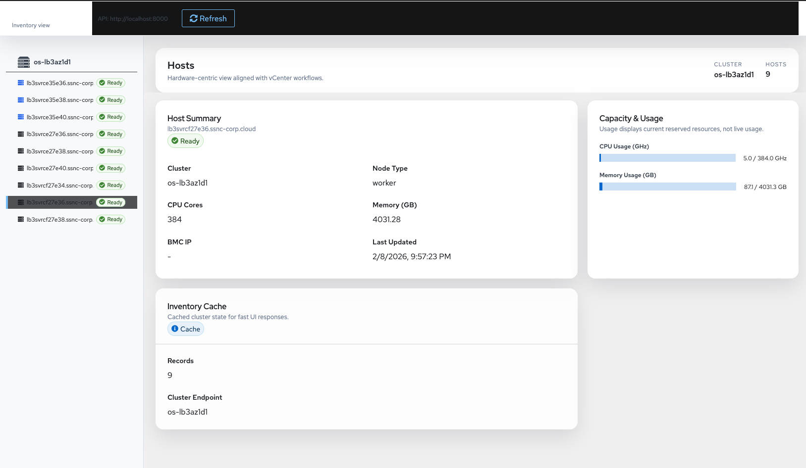

# KubeVirtCenter

**KubeVirtCenter** is a "Bridge UI" designed to provide VMware Operations teams with a familiar, hardware-centric view of an OpenShift/KubeVirt environment. 

While OpenShift treats infrastructure as an abstraction, Ops teams need to fix hardware. KubeVirtCenter translates Kubernetes concepts back into the "vCenter language" of Hosts, Datastores, and Port Groups.

## 🚀 The Vision
To reduce the cognitive load of migrating from VMware to OpenShift by providing a UI that mirrors the **vSphere Client** layout, using **VMware Clarity** design components.

## 🛠 Conceptual Mapping (The Translation Layer)

| VMware Concept | KubeVirt / OpenShift Equivalent | Primary View |
| :--- | :--- | :--- |
| **ESXi Host** | `Node` + `BareMetalHost` | Physical Asset & iDRAC Status |
| **Datastore** | `StorageClass` + `PVC` | Aggregated Backend Capacity |
| **Port Group** | `NetworkAttachmentDefinition` | VLAN & Physical Bridge Mapping |
| **vMotion** | `Live Migration` | VM Action Menu |
| **Maintenance Mode** | `Node Cordon/Drain` | Host Management |

## Current State

## 🏗 Architecture
KubeVirtCenter follows the **Ultron/ShiftServer** design pattern:

1. **Backend:** FastAPI + SQLModel for high-performance data serving.
2. **Database:** PostgreSQL inventory that caches physical hardware details (Serial Numbers, Rack Locations, BMC IPs).
3. **Sync:** A Kubernetes Controller (Watcher) that pushes real-time cluster changes into the DB.
4. **Frontend:** A modern Javascript UI built with **VMware Clarity** (initial) or **PatternFly** (long-term).

## 🔧 Getting Started

### Prerequisites
- Python 3.10+
- Access to an OpenShift Cluster with the **Bare Metal Operator** installed.
- PostgreSQL instance.

### 📋 Features to Implement
- [ ] Host Tree-View: Left-hand navigation grouped by Cluster/Datacenter.
- [ ] iDRAC Deep-linking: One-click access to physical hardware consoles.
- [ ] Storage Health Rollups: View "Datastore" latency and capacity at a glance.
- [ ] YAML Toggle: A "Show K8s Native" button to help Ops learn the underlying CRDs.

